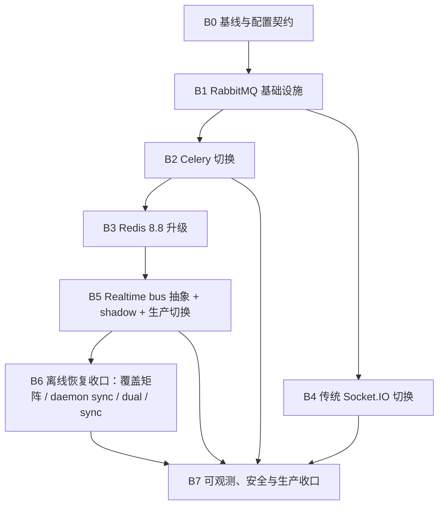

# Redis 8 与 RabbitMQ 消息基础设施方案 B 实施文档

> 状态：B0–B7 代码实现均已合入 `huanxing`；生产切换只完成 Celery（B2-02）。
> B3-02 生产切换被共享 Redis 归属门禁阻断；B4/B5/B6 仍在生产默认值（Redis）上运行。
>
> 日期：2026-07-29（2026-07-31 缺陷评审后修订）
>
> 架构事实源：[`Redis 8 与 RabbitMQ 消息基础设施迁移方案`](Redis8与RabbitMQ消息基础设施迁移方案.md)
>
> 目标仓：`hasn-cloud-backend` / `huanxing`；涉及 daemon 的任务在 `hasn-node` / `main` 独立实施
>
> 不在本次范围：管理端改造、RabbitMQ 跨地域集群、WebUI 改版、每用户 RabbitMQ 持久队列

## 1. 实施目标

本实施文档把已裁决的方案 B 拆成可独立上线、独立验证、独立回滚的施工任务：

1. RabbitMQ 接管 Celery broker。
2. 传统 Socket.IO 的跨进程通知从 Redis manager 迁到 RabbitMQ。
3. HASN `/ws/node` 保留 Redis pending/processing 可靠暂存，跨 worker 唤醒从 Redis Pub/Sub 迁到 RabbitMQ。
4. PostgreSQL 消息事实、IM integration event、`hasn_sync_events` 与历史快照接管离线恢复正确性。
5. Redis 升级到 8.8，继续承担 presence、节点路由、连接代际、TTL、锁、限流和缓存。
6. OpenTelemetry、Prometheus、Grafana 和生产 runbook 覆盖新增链路。

本次不追求“一次性统一消息中间件”。每阶段必须满足自己的退出门槛，上一阶段未稳定时不得开始下一阶段生产切换。

## 2. 当前基线与缺口

### 2.1 已有能力

| 能力 | 当前实现 | 可复用程度 |
|---|---|---|
| Celery RabbitMQ 配置 | `backend/app/task/celery.py` 已支持 `CELERY_BROKER=rabbitmq` | 高，但缺显式 queue、confirm、heartbeat 和真实 RabbitMQ E2E |
| RabbitMQ Python 依赖 | `aio-pika` 已在 `server` dependency group，Celery/Kombu 已随 Celery 安装 | 高 |
| Socket.IO | `AsyncRedisManager` + 同步 `RedisManager(write_only=True)` | 中，需要 manager factory 和 RabbitMQ 互通测试 |
| IM 权威事件 | PostgreSQL integration events + durable `SyncProjector` | 高 |
| 在线实时推送 | best-effort `RealtimeNotifier` → `NodeSessionRealtimeGateway` | 高 |
| 跨 worker 唤醒 | Redis pending/processing LIST + Redis Pub/Sub | 中，数据暂存保留，只替换唤醒适配器 |
| 离线恢复 | Redis `hasn:offline:*` 7 天 + daemon sync cursor/history snapshot | 中，需要按帧类型证明 durable 恢复覆盖 |
| 可观测性 | FastAPI、Celery、Redis、PostgreSQL 已接入 OpenTelemetry | 中，缺 RabbitMQ 手工 span 和 broker 指标 |

### 2.2 必须先修正的认识

- `RealtimeNotifier` 已经从 PostgreSQL integration events 消费消息事实；RabbitMQ 不需要成为第二个消息事实源。
- 定向 `/ws/node` 帧在 RabbitMQ 切换初期仍先落 Redis `hasn:ws:pending:*`。RabbitMQ 只携带 `node_id/event_id` 唤醒，不能携带一份新的长期消息副本。
- RabbitMQ consumer ACK 只代表云端 worker 已处理唤醒，不代表 daemon 已写入 SQLite。
- Redis offline 列表不能直接删除。必须先逐类证明对应帧可由 sync pull、历史快照或其它 durable projection 恢复。
- 初期 RabbitMQ 是同机单节点，只改善进程隔离、任务语义和可观测性，不宣称整机高可用。

## 3. 固定实施契约

### 3.1 数据职责

| 数据 | 权威存储 | RabbitMQ 角色 | Redis 角色 |
|---|---|---|---|
| Celery 任务 | 业务表/任务结果表 | durable classic queue | 无 |
| IM 消息 | PostgreSQL `hasn_messages` / integration events | 实时唤醒 | presence、短期 pending |
| 下行同步 | PostgreSQL `hasn_sync_events` | 可选 wake-up | 不作为事实源 |
| 历史恢复 | PostgreSQL 历史快照 | 无 | 无 |
| 在线路由 | Redis | 传递变化通知，不提供查询 | 权威查询 |
| Socket.IO 通知 | 无持久事实，在线 best-effort | fanout | 切换后无 |

### 3.2 配置契约

保留现有 Celery 变量，新增配置必须在 `backend/core/conf.py`、`backend/.env.example` 和配置测试中同时出现。

| 配置 | 允许值/默认值 | 说明 |
|---|---|---|
| `CELERY_BROKER` | `redis` / `rabbitmq`，迁移期默认 `redis` | 已存在 |
| `CELERY_BROKER_MODE` | `inherit` / `redis` / `rabbitmq`，默认 `inherit` | 仅供容器/进程环境注入，避免与 Celery CLI 同名 URL 变量冲突 |
| `CELERY_RABBITMQ_*` | 现有 host/port/user/password/vhost | 仅 Celery 账号 |
| `SOCKETIO_MANAGER` | `redis` / `rabbitmq`，默认 `redis` | 传统 Socket.IO manager |
| `REALTIME_RABBITMQ_HOST` | 默认 `127.0.0.1` | Socket.IO 与 HASN realtime 共用连接端点 |
| `REALTIME_RABBITMQ_PORT` | 默认 `5672` | 不开放公网 |
| `REALTIME_RABBITMQ_VHOST` | 默认 `huanxing` | URL 编码后拼入 DSN |
| `REALTIME_RABBITMQ_USERNAME` | 无默认生产账号 | `huanxing_realtime` |
| `REALTIME_RABBITMQ_PASSWORD` | 无默认生产密码 | 只进入忽略文件/密钥管理 |
| `HASN_REALTIME_BUS` | `redis` / `rabbitmq`，默认 `redis` | 当前实际驱动 |
| `HASN_REALTIME_SHADOW_RABBITMQ` | `false` / `true`，默认 `false` | 双发、消费、计数，但不触发 WS 下发 |
| `HASN_OFFLINE_RECOVERY` | `redis` / `dual` / `sync`，默认 `redis` | 离线恢复切换 |
| `REDIS_PROTOCOL` | `2` / `3`，默认 `2` | B3 新增，显式固定 RESP，避免跟随客户端默认值漂移 |
| `REDIS_LIST_MOVE_MODE` | `lua` / `lmove`，默认 `lua` | B3 新增，Redis 6 兼容 Lua 与 Redis 8 原生 `LMOVE` 的显式切换 |

`HASN_REALTIME_SHADOW_RABBITMQ=true` 只允许 Rabbit consumer 做格式校验、延迟和覆盖率计数，禁止调用 `_deliver_local`。这样可以避免“双通道同时驱动下发”的歧义。

shadow 的“不影响用户”必须同时覆盖三个维度，只对齐下发次数是不够的：

- **次数**：consumer 只计量，不触发 WS send 或 pending drain；
- **延迟**：RabbitMQ 双发在后台任务中完成，active Redis 发布返回即结束用户请求；
  在途双发有上限（`SHADOW_MAX_INFLIGHT_PUBLISHES`），超限直接丢弃并计量；
- **可用性**：shadow 队列就绪失败只告警降级为纯 Redis，不阻塞 API 启动。
  `HASN_REALTIME_BUS=rabbitmq`（active）时队列就绪仍是启动硬门禁。

启动日志记录 celery broker、socketio manager、realtime bus、shadow 开关、offline 恢复模式
和 RabbitMQ 端点（`registrar.py` 的「消息通道：…」行）；不得记录用户名、密码或完整 DSN，
涉及 RabbitMQ 的日志一律只输出 `describe_rabbitmq_endpoint` 给出的 `host/port/vhost` 描述。

### 3.3 RabbitMQ topology

| 用途 | Exchange | Queue | 持久性 |
|---|---|---|---|
| Celery | `huanxing.celery` / direct | `huanxing.celery.default` | durable classic |
| Socket.IO | `huanxing.socketio` / fanout | manager 自动生成的临时队列 | non-durable、auto-delete |
| HASN realtime | `huanxing.realtime` / fanout | `huanxing.realtime.worker.<instance_id>` | exclusive、auto-delete |

`instance_id` 默认取进程内随机 UUID（`RabbitMQRealtimeWakeupBus` 惰性构造），
不是跨重启稳定的编号：队列声明为 `exclusive` + `auto_delete`，随连接消亡即回收，
不需要稳定命名来复用。`x-expires` 只是异常路径的兜底，exclusive 队列正常不会走到它。

约束：

- Celery queue 开启 publisher confirm；confirm 返回前断线仍属于“broker 可能已接收”的歧义结果，
  生产者只能使用稳定 `task_id`/业务幂等键重投，不能把 confirm 当作 exactly-once。
- 可由数据库状态机、唯一键或 outbox 收敛的任务使用 late ACK，保持至少一次投递语义；业务写点必须幂等。
- 调用 LLM、爬虫或不支持幂等键的外部服务等不可事务化副作用任务必须显式使用 early ACK，
  并按用户可见性提供数据库权威状态和周期恢复扫描；其外部调用成本/效果不宣称 exactly-once。
- 自动渠道发送只有在 provider 明确保证按稳定 `idempotency_key` 去重时才允许注册；
  发送成功但数据库提交前崩溃的歧义由 provider 去重和数据库恢复共同收敛。
- Redis 回滚模式固定使用项目独占队列 `huanxing.celery.rollback`；禁止复用通用
  `celery` 队列，避免同机其他 Celery 项目误消费回滚任务。
- Socket.IO 与 HASN realtime queue 都是在线临时通道，不承担离线消息。
- HASN 第一版给每个 API worker 一份 fanout 消息，再由本地连接表和 Redis generation 判断是否持有目标连接。
- 单节点不使用 quorum queue。建设 3 节点集群后另行评估。

### 3.4 HASN realtime 事件信封

事实源是 `rabbitmq_realtime_wakeup_bus.py` 的 `encode_node_wakeup` /
`encode_broadcast_wakeup` / `decode_wakeup_event`。定向与广播两种形状：

```json
{ "version": 1, "event_id": "…", "sent_at_ms": 1777500000000, "kind": "node", "node_id": "n_…" }
{ "version": 1, "event_id": "…", "sent_at_ms": 1777500000000, "kind": "broadcast", "payload": "{…}" }
```

`traceparent` 走 AMQP message headers（`inject_rabbitmq_trace_headers`），不进 body。

要求：

- `event_id` 全局唯一，用于双通道 shadow 对账和指标去重。
- 定向事件不携带消息正文；正文已在 Redis pending 列表或 PostgreSQL 权威投影中。
- 广播仅允许携带可由 revision 对账恢复的小型失效通知（当前只有 `hasn.sync.invalidate`）。
- 未识别的 `version`/`kind` 必须告警并 ACK，禁止无限 requeue。
- **解码只校验必需键，忽略未识别的新增键**：滚动发布期间新 publisher 补字段时旧 worker
  必须继续消费，否则一次加字段就是一整轮全量丢帧。不兼容变更只能通过提升 `version` 表达。
- 消费失败是否 requeue 按错误类型固定：连接级瞬时错误由 robust connection 恢复；畸形消息 ACK 丢弃；业务下发失败 ACK 并等待 Redis pending 周期 drain 或 sync pull 恢复。
- publish 位于用户消息发送热路径，必须有上界：`PUBLISH_TIMEOUT_SECS` 限制 confirm 等待，
  `PUBLISHER_RECOVERY_TIMEOUT_SECS` 限制 robust channel 恢复等待，重建后立即重放且不做
  退避 sleep。broker 进入 `connection.blocked`（memory/disk alarm）时宁可超时也不能挂住请求。
- fanout 上暂无绑定队列是**预期状态**（API worker 全部重启中，或发布方本身不消费）：
  channel 使用 `on_return_raises=True`，`PublishError` 计入 `result="returned"` 并直接返回，
  不重建连接、不重试。若按「confirmed」统计，被退回的唤醒会混进确认数，指标即失真。

## 4. 依赖关系与施工顺序

阶段编号以下图与 §5 为准（两处使用同一套 B0–B7 编号）：



复杂阶段必须使用确定性 worktree 分支。开始施工时把“任务号、分支名、worktree 路径、目标仓”登记在本文进度表；禁止提前创建全部分支。

原计划按阶段拆五条分支；实际施工把 B0–B7 的后端改动全部落在
`fix/rabbitmq-b-celery` 一条分支上（见 §7），只有 B6-02 的 daemon 改动走
`hasn-node` 独立分支。此处保留计划仅作参考，**以 §7 登记的实际分支为准**。

| 任务段 | 后端计划分支 | 实际分支 | hasn-node |
|---|---|---|---|
| B0–B2 | `fix/rabbitmq-b-celery` | `fix/rabbitmq-b-celery` | 不涉及 |
| B3 | `fix/rabbitmq-b-redis8` | `fix/rabbitmq-b-celery` | 不涉及 |
| B4 | `fix/rabbitmq-b-socketio` | `fix/rabbitmq-b-celery` | 不涉及 |
| B5 | `fix/rabbitmq-b-realtime` | `fix/rabbitmq-b-celery` | 不涉及 |
| B6 | `fix/rabbitmq-b-offline-sync` | `fix/rabbitmq-b-celery` | `fix/doc03-message-history-bootstrap` |
| B7 | `fix/rabbitmq-b-observability` | `fix/rabbitmq-b-celery` | 不涉及 |
| 缺陷收口 | — | `fix/rabbitmq-b-defect-fix` | 不涉及 |

## 5. 分阶段任务

### 阶段 B0：基线和开关

#### 任务 B0-01：冻结现网消息链路基线

**描述：** 在不改变现网行为的前提下，记录 Redis、Celery、Socket.IO、`WsDeliveryBus` 和 offline 的版本、吞吐、延迟、积压与错误基线，形成迁移前对照。

**验收条件：**

- [ ] 记录在线投递 p50/p95/p99、Celery queue depth、Redis CPU/内存和 API worker CPU。
- [ ] 记录 4 worker 下定向投递、广播、断线重连和 7 天 offline key 的现状。
- [ ] 基线数据不包含消息正文、owner/node/message 等高基数标签。

**验证：**

- [ ] 使用真实 PostgreSQL、Redis、API worker 和 daemon 跑现有 P0 E2E。
- [ ] 保存命令、时间窗、版本和原始指标截图/导出路径。

**依赖：** 无。

**预计文件：**

- `docs/Redis8与RabbitMQ消息基础设施方案B实施证据.md`（实施时新建）
- 父仓 `docs/生产部署/部署记录/<日期>-消息基础设施迁移基线.md`

**预计规模：** S，0.5–1 人日。

#### 任务 B0-02：新增配置模型与启动守卫

**描述：** 落实 §3.2 配置契约，只增加开关、DSN 构造与显式校验，默认仍走 Redis。

**验收条件：**

- [x] 所有新增变量在配置模型、示例环境文件和配置测试中一致。
- [x] 选择 RabbitMQ 且缺少账号/密码时启动失败，错误不泄漏密码。
- [x] 默认配置运行行为与改动前一致。

**验证：**

- [x] `uv run pytest backend/tests/test_rabbitmq_settings.py -q`
- [x] `uv run mypy backend/core/conf.py backend/common/messaging/`

**依赖：** B0-01。

**预计文件：**

- `backend/core/conf.py`
- `backend/.env.example`
- `backend/common/messaging/rabbitmq.py`（新建）
- `backend/tests/test_rabbitmq_settings.py`（新建）

**预计规模：** M，0.5–1 人日。

### 阶段 B1：RabbitMQ 基础设施

#### 任务 B1-01：固化 RabbitMQ 安全配置和 definitions

**描述：** 为单节点 RabbitMQ 4.3.x 固化 loopback 监听、`huanxing` vhost、资源限额、用户权限正则和无密码 definitions 模板。运行时密码通过本机忽略文件或密钥管理注入。

**验收条件：**

- [x] 5672、15672、15692 只监听 `127.0.0.1`；额外收口 4369、25672。
- [x] `guest` 禁用或不能远程登录，Celery、realtime、monitor 三个账号权限分离。
- [x] definitions 中没有明文密码、默认口令和完整生产 DSN。
- [x] 数据、日志和备份落 `/data2`，根盘不会因队列增长被写满。

**验证：**

- [x] `rabbitmq-diagnostics status`
- [x] `rabbitmq-diagnostics check_running`
- [x] `rabbitmq-diagnostics check_local_alarms`
- [x] 从公网探测 5672/15672/15692 均不可达；SSH 隧道内管理面可达。
- [x] RabbitMQ 重启后 vhost、exchange、queue policy 和权限仍存在。

**依赖：** B0-02。

**实际文件：**

- `deploy/rabbitmq/rabbitmq.conf`
- `deploy/rabbitmq/definitions.json`（`"users": []`，不含密码）
- `deploy/rabbitmq/docker-compose.yml`、`bootstrap.sh`、`enabled_plugins`
- `deploy/rabbitmq/huanxing-rabbitmq-prometheus-proxy.{service,socket}`（私网采集）
- `deploy/rabbitmq/README.md`
- 父仓 `docs/生产部署/` 下生产 runbook

**预计规模：** M，2–4 人日。

### 检查点一：基础设施就绪

- [x] RabbitMQ 单节点故障边界已明确，不宣称 HA。
- [x] 公网端口不可达，最小权限和强密码已验证。
- [x] Prometheus endpoint 仅被本机采集。
- [x] 应用仍全部走 Redis，RabbitMQ 上没有真实业务任务。

### 阶段 B2：Celery broker 切换

#### 任务 B2-01：补齐 Celery RabbitMQ 可靠性参数

**描述：** 复用现有 RabbitMQ broker 分支，显式配置 exchange/queue、publisher confirm、heartbeat、启动重连、prefetch 和队列持久性；结果后端保持 PostgreSQL。

**验收条件：**

- [x] 默认 queue/exchange 固定为 `huanxing.celery.default` / `huanxing.celery`。
- [x] publisher confirm 开启；broker 连接失败不会静默改走 Redis。
- [x] worker、beat、Flower、inspect、revoke 和任务事件在 RabbitMQ 下可用。
- [x] Redis broker 模式继续可用作迁移期回滚。

**验证：**

- [x] `uv run pytest backend/tests/tasks/test_celery_broker_config.py -q`
- [x] 真实 RabbitMQ E2E 覆盖普通任务、失败重试、ETA/countdown、Beat、Flower。
- [x] RabbitMQ 分别在 publish 前、confirm 前、consumer ACK 前中断，观察任务至少一次语义和幂等结果。

**依赖：** B1-01。

**预计文件：**

- `backend/app/task/celery.py`
- `backend/core/conf.py`
- `backend/.env.example`
- `backend/tests/tasks/test_celery_broker_config.py`（新建）
- `backend/tests/tasks/test_celery_rabbitmq_e2e.py`（新建，真实 RabbitMQ）

**预计规模：** M，1–2 人日。

#### 任务 B2-02：执行 Celery 生产切换

**描述：** 按“停 Beat → 排空 Redis broker → 停 worker → 切配置 → 启 worker → 启 Beat/Flower”的顺序切换，禁止两个 broker 同时接收 Beat 任务。

**验收条件：**

- [x] Redis broker 的 active/reserved/scheduled 和待消费队列为 0。
- [x] RabbitMQ worker 能消费真实无副作用探针任务，PostgreSQL result 正常。
- [x] API、worker、beat、Flower 四个服务稳定运行，旧 Redis broker 无新增写入。

**验证：**

- [x] `celery -A backend.app.task.celery inspect active`
- [x] `celery -A backend.app.task.celery inspect reserved`
- [x] `celery -A backend.app.task.celery inspect scheduled`
- [x] `rabbitmqctl list_queues name messages_ready messages_unacknowledged consumers`
- [x] 观察至少一个完整 Beat 周期。

**依赖：** B2-01。

**预计文件：**

- 父仓 `docs/生产部署/部署记录/<日期>-Celery切换RabbitMQ.md`
- 生产 `.env`（不入仓）

**预计规模：** S，1 人日。

### 检查点二：Celery 已解耦

2026-07-31 在生产实测复核（切换窗口为 2026-07-30 03:56 CST，已超 24 小时）：

- [x] Celery 在 RabbitMQ 上稳定运行至少 24 小时。`rabbitmqctl status` 显示
      `Uptime (seconds): 155762`（≈43.3 小时），RabbitMQ 4.3.4，`check_local_alarms` 无告警。
- [x] 无持续增长的 ready/unacked 队列。`huanxing.celery.default = 0 / 0 / consumers 1`；
      另有 2 个 `celeryev.*` 与 1 个 pidbox 临时队列，均为 0。
- [x] Redis DB 1 不再承担 Celery broker 写入。`dbsize=4`，`*celery*` 与 `_kombu*` 均为 0 个 key，
      `huanxing.celery.rollback` 与同机通用 `celery` 队列长度均为 0。
- [x] RabbitMQ 故障回滚流程已实操，不只是文档推演。

### 阶段 B3：Redis 8.8 升级

#### 任务 B3-01：完成 Redis 8 / redis-py 8 兼容性测试

**描述：** 在 Celery 已离开 Redis 后升级 redis-py，真实验证 RESP3、Lua/LMOVE、pipeline、Pub/Sub、presence、锁、TTL 和 OpenTelemetry。不得用 fake Redis 代替集成测试。

**验收条件：**

- [x] redis-py 锁定到经过测试的 8.x 精确版本，`uv.lock` 更新。
- [x] async connection pool 不再触发 OpenTelemetry 连接池指标回调错误。
- [x] Redis 6 兼容 Lua 与 Redis 8 原生 `LMOVE` 的切换有测试，顺序均保持 FIFO。
- [x] RESP2/RESP3 选择显式，不依赖客户端默认值漂移。

**验证：**

- [x] `uv run pytest backend/tests/test_redis_observability.py backend/tests/hasn/test_ws_delivery_bus.py -q`
- [x] 使用真实 Redis 8.8 运行 presence、锁、TTL、Pub/Sub、pending/processing 集成测试。
- [x] `uv run mypy backend/database/redis.py backend/app/hasn_im/adapters/routing/`

**依赖：** B2-02。

**预计文件：**

- `pyproject.toml`
- `uv.lock`
- `backend/database/redis.py`
- `backend/app/hasn_im/adapters/routing/delivery_bus.py`
- 对应 Redis/WS 测试

**预计规模：** M，1–2 人日。

#### 任务 B3-02：执行 Redis 8.8 蓝绿切换

**描述：** 新端口部署 Redis 8.8，恢复 Redis 6 RDB，先验证再分批切 API/worker；旧实例在观察窗内只读保留。

**验收条件：**

- [x] RDB 恢复、key 数、TTL 分布和关键结构抽样一致。
- [ ] API worker 分批切换期间没有双写分叉。
- [ ] presence、路由、锁、限流、Socket.IO fallback 和 realtime pending 全部通过。

**验证：**

- [x] 切换前、Redis 8 恢复后 `INFO`, `DBSIZE`, `MEMORY STATS` 留证。
- [ ] 4 worker 实时投递与断线重连真实 E2E。
- [ ] 连续观察 24 小时无 OTel Redis callback 错误。

**依赖：** B3-01。

**预计文件：**

- 父仓 `docs/生产部署/部署记录/<日期>-Redis8蓝绿切换.md`
- 生产 Redis 配置和 `.env`（敏感项不入仓）

**预计规模：** M，1–2 人日。

### 阶段 B4：传统 Socket.IO 切换

#### 任务 B4-01：建立 Socket.IO manager factory

**描述：** 把 server 和同步 task notification publisher 的硬编码 Redis manager 收口到同一 factory；RabbitMQ 分支分别返回 `AsyncAioPikaManager` 和可与其互通的同步 publisher。

**验收条件：**

- [x] `SOCKETIO_MANAGER=redis` 行为不变。
- [x] RabbitMQ 模式下，每个 API worker 有独立临时 fanout queue。
- [x] 同步 Celery publisher 发出的 `task_notification` 能被异步 API manager 和真实客户端收到。
- [x] manager 初始化失败显式阻止对应进程启动，不做假 fallback。

**验证：**

- [x] `uv run pytest backend/tests/socketio/test_manager_factory.py -q`
- [x] 真实 RabbitMQ 下启动两个 API 进程和一个 Celery publisher，验证跨进程通知。
- [ ] 断开 RabbitMQ 后恢复连接，确认 manager 自动恢复且不出现无限日志洪水。

**依赖：** B1-01；建议在 B2 稳定后上线。

**预计文件：**

- `backend/common/socketio/manager.py`（新建）
- `backend/common/socketio/server.py`
- `backend/common/socketio/actions.py`
- `backend/core/conf.py`
- `backend/tests/socketio/test_manager_factory.py`（新建）

**预计规模：** M，1–2 人日。

### 检查点三：传统通道稳定

- [ ] Socket.IO Redis/RabbitMQ 两种模式均有真实互通证据。
- [ ] 任务通知丢失不会影响任务事实和结果查询。
- [ ] 已登记后续退役传统 Socket.IO 的独立任务，避免兼容层永久化。

### 阶段 B5：HASN realtime bus 抽象

#### 任务 B5-01：提取 realtime wake-up port 和 Redis adapter

**描述：** 把 `delivery_bus.py` 中的 Redis Pub/Sub 发布/订阅抽成 `RealtimeWakeupBus`；Redis pending/processing、generation 校验和 `_safe_send` 保持原位，先做零行为变化重构。

**验收条件：**

- [x] port 只暴露 `publish_node_wakeup`、`publish_broadcast`、`start`、`stop`。
- [x] Redis adapter 产生与当前相同的 `hasn:ws:deliver` 消息。
- [x] `WsDeliveryBus` 不直接创建 Redis Pub/Sub 连接。
- [x] 现有定向、广播、generation、processing 恢复测试全部不改语义通过。

**验证：**

- [x] `uv run pytest backend/tests/hasn/test_ws_delivery_bus.py backend/app/hasn_im/tests/test_routing_delivery_bus.py -q`
- [x] `uv run mypy backend/app/hasn_im/ports/ backend/app/hasn_im/adapters/routing/`

**依赖：** B3-02。

**预计文件：**

- `backend/app/hasn_im/ports/realtime_wakeup_bus.py`（新建）
- `backend/app/hasn_im/adapters/routing/redis_realtime_wakeup_bus.py`（新建）
- `backend/app/hasn_im/adapters/routing/delivery_bus.py`
- `backend/core/registrar.py`
- 对应测试

**预计规模：** M，2–3 人日。

#### 任务 B5-02：实现 RabbitMQ realtime adapter

**描述：** 用 `aio-pika` robust connection 实现 fanout exchange、每 worker exclusive queue、schema 校验、ACK 和 reconnect；定向消息只唤醒 Redis pending drain。

**验收条件：**

- [x] 每个 API worker 使用独立临时 queue（`exclusive` + `auto_delete`，队列名由进程内
      随机 instance ID 派生；不需要跨重启稳定，队列随连接回收）。
- [x] 定向 wake-up 到达所有 worker，但只有持有目标连接且 generation 匹配的 worker drain。
- [x] 畸形事件告警并 ACK；业务 send 失败不 requeue 风暴。
- [x] 未识别的新增键被忽略而非整帧丢弃，滚动发布向前兼容。
- [x] publish 有超时上界；不可路由的退回单列 `returned`，不计入 confirmed、不触发重连。
- [x] stop 时 consumer、channel、connection 有序关闭。

**验证：**

- [x] `uv run pytest backend/tests/hasn/test_rabbitmq_realtime_bus.py -q`
- [ ] 真实 RabbitMQ + 4 API worker + 真实 Redis 下覆盖定向、广播、worker 重启和 broker 重启（四个独立 consumer 与隔离 broker 真实重启已分别通过，完整组合拓扑待验）。
- [ ] RabbitMQ 停机时 Redis pending 中的定向帧仍保留，恢复或周期 drain 后可发送。

**依赖：** B5-01。

**预计文件：**

- `backend/app/hasn_im/adapters/routing/rabbitmq_realtime_wakeup_bus.py`（新建）
- `backend/app/hasn_im/adapters/routing/realtime_wakeup_factory.py`（新建）
- `backend/core/registrar.py`
- `backend/tests/hasn/test_rabbitmq_realtime_bus.py`（新建）
- `backend/app/hasn_im/observability/metrics.py`

**预计规模：** M，2–3 人日。

#### 任务 B5-03：实现 shadow 对账和切换开关

**描述：** `HASN_REALTIME_SHADOW_RABBITMQ=true` 时 Redis 继续实际驱动，RabbitMQ 双发并只统计，不触发 `_deliver_local`；达到门槛后切换 `HASN_REALTIME_BUS=rabbitmq`。

**验收条件：**

- [x] shadow 统计 publish 数、consume 数、格式错误数和端到端延迟。
- [x] shadow consumer 不调用 WS send/drain。
- [x] active bus 同一时刻只能有一个，非法组合启动失败。
- [x] 切换和回滚不需要修改代码。

**验证：**

- [x] 双发 10 万条 wake-up，按 `event_id` 对账覆盖率 100%。
- [x] shadow 期间用户可见下发次数与纯 Redis 基线一致。
- [ ] Rabbit active 后 Redis Pub/Sub 无新增 publish，pending/processing LIST 继续工作。

**依赖：** B5-02。

**预计文件：**

- `backend/app/hasn_im/adapters/routing/realtime_wakeup_factory.py`
- `backend/app/hasn_im/adapters/routing/delivery_bus.py`
- `backend/app/hasn_im/observability/metrics.py`
- `backend/core/conf.py`
- 对应测试

**预计规模：** M，1–2 人日。

### 检查点四：Realtime 切换

- [ ] shadow 连续 24 小时覆盖率为 100%，没有格式漂移。
- [ ] Rabbit active 模式 p95 相对 Redis 基线劣化不超过 10%，p99 不超过 200 ms。
- [ ] 用户可见重复为 0，RabbitMQ 重启不要求 API 重启。
- [ ] Redis pending/processing 和周期 drain 仍能弥补 RabbitMQ 唤醒窗口。
- [ ] 回滚到 Redis bus 已实操。

### 阶段 B6：离线恢复收口

#### 任务 B6-01：建立离线帧 durable 覆盖矩阵

**描述：** 枚举所有 `_enqueue_offline` 上游帧，逐项标记其 PostgreSQL 事实、sync event、客户端幂等键和历史恢复路径。未证明可恢复的帧不得进入 `sync` 模式。

**验收条件：**

- [x] 每种离线帧都归类为“durable sync”“瞬时无需离线”或“缺口待补”。
- [x] `hasn.message.new`、撤回、会话失效、任务卡片等关键帧有稳定 `event_id/message_id`。
- [x] 对缺口只补 PostgreSQL sync event 或业务 outbox，不新增 RabbitMQ per-user queue。

**验证：**

- [x] 静态守卫覆盖所有 `_enqueue_offline` 调用点，新增调用未登记即失败。
- [x] 用真实 PostgreSQL 验证同一业务事务失败/重试不会产生不可恢复消息。

**依赖：** B5-03。

**预计文件：**

- `docs/方案B离线帧Durable覆盖矩阵.md`（新建）
- `backend/app/hasn_im/tests/test_architecture_guards.py`
- `backend/app/hasn_im/adapters/routing/node_session_service.py`
- 必要的 sync projector 测试

**预计规模：** M，1–2 人日。

#### 任务 B6-02：补齐 daemon 常驻 sync pull 与 SQLite 提交语义

**描述：** 在 `hasn-node` 中确保 wake-up、重连和周期任务都能触发 sync pull；只有事件已在 SQLite 事务中幂等提交后才推进 cursor。WebSocket transport 成功不能作为最终 delivery ACK。

**验收条件：**

- [ ] 相同 `event_id/message_id` 经 WS 和 sync pull 同时到达时，SQLite 用户可见恰好一次。
- [ ] SQLite 写失败时 cursor 不前进，恢复后可重放。
- [ ] daemon 离线超过 Redis TTL 后仍能通过 sync/history snapshot 恢复。
- [ ] retention gap 返回确定状态并自动进入历史快照，不无限重试旧 cursor。

**验证：**

- [ ] `cargo test -p hasn-node sync_pull`
- [ ] `cargo test -p hasn-daemon --test cross_device_msg_sync`
- [ ] `python3 tests/p0_real_e2e.py`
- [ ] 真实云端、PostgreSQL 和双设备 E2E；禁止 mock/fake backend。

**依赖：** B6-01。

**预计文件（`hasn-node`）：**

- `apps/daemon/src/wire_session/inbound/mod.rs`
- `crates/hasn-node/src/runtime/sync_pull.rs`
- `crates/hasn-node/src/persistence/sync_store.rs`
- `apps/daemon/tests/cross_device_msg_sync.rs`
- 必要的消息写入测试

**预计规模：** M，3–5 人日。

#### 任务 B6-03：实现 offline dual 模式与对账

**描述：** `HASN_OFFLINE_RECOVERY=dual` 时 Redis offline LIST **继续读写**，同时让
PostgreSQL sync/history 承担同一批帧的恢复，对两条路径的稳定消息 ID 做 shadow 对账。

dual 是切 `sync` 前的**观测窗，不是提前切换**：若 dual 就停掉 Redis 读路径，daemon 侧
sync 一旦有缺口，用户在观测期内已经丢帧，7 天对账只剩事后统计，起不到「先观测后切换」
的作用。同一帧经 WS 与 sync pull 重复到达由客户端按稳定 `message_id`/`event_id` 去重。

**验收条件：**

- [ ] dual 不向客户端重复展示消息（依赖客户端稳定 ID 去重，daemon 侧已有
      `pull_once_replay_is_idempotent_on_duplicate_message_id` 覆盖）。
- [ ] 对账区分“Redis 独有”“sync 独有”“两边都有”，但指标不使用用户 ID 标签。
- [ ] 走权威快照恢复的联系人帧必须真实查证（`snapshot_verified`），查不到的计入
      `snapshot_unverified` 并汇入 `redis_only_unrecoverable`，不得默认算作可恢复。
- [ ] RabbitMQ、Redis 或 API worker 任一重启后，PostgreSQL 路径仍能追平。
- [ ] 连续 7 天的对账报告（每 5 分钟一轮采样）能证明 Redis 没有不可替代的独有消息。
      注意 Redis 影子在 dual 下会被正常补推消费，报告反映的是**当时仍在积压的**候选集合，
      不是「Redis 里静态保存 7 天的证据」。

**验证：**

- [ ] 断网、双设备、消息撤回、成员变更、任务卡片和 retention gap E2E。
- [ ] 连续 7 天生产 shadow 报告中 `redis_only_unrecoverable=0`。

**依赖：** B6-02。

**预计文件：**

- `backend/app/hasn_im/adapters/routing/node_session_service.py`
- `backend/app/hasn_im/observability/metrics.py`
- `backend/app/hasn_im/tests/test_task_dispatch_outbox_pg.py`
- `backend/tests/hasn/test_ws_delivery_bus.py`
- 父仓生产观察记录

**预计规模：** M，2–4 人日。

#### 任务 B6-04：停止 Redis offline 权威写入

**描述：** 达到 7 天 shadow 门槛后切换 `HASN_OFFLINE_RECOVERY=sync`，停止新写 `hasn:offline:*`；旧 key 观察一个完整 TTL 周期后再清理兼容代码。

**验收条件：**

- [ ] `sync` 模式不会读写 `hasn:offline:*`，且启动门禁
      `assert_offline_recovery_mode_supported` 在矩阵仍有 `gap` 帧时拒绝进程启动。
- [ ] 支持中的所有客户端均具备 durable sync cursor 和历史快照恢复。
- [ ] Redis offline key 数只降不升，且 PostgreSQL/sync 可恢复全部关键消息。
      （入队本身已有 `OFFLINE_MAX_LENGTH` 上限与原子续期，单键长度不会无界增长。）
- [ ] 清理旧 key 前保留切回 `dual` 的代码开关。

**验证：**

- [ ] 7 天以上离线、空库恢复、双设备并发、断点重连真实 E2E。
- [ ] 清理前后 `SCAN hasn:offline:*` 计数、抽样消息 ID 与 sync feed 对账留证。
- [ ] 回滚到 `dual` 时可从 PostgreSQL 重新构建加速数据，不依赖旧 key。

**依赖：** B6-03。

**预计文件：**

- `backend/app/hasn_im/adapters/routing/node_session_service.py`
- `backend/app/hasn_im/adapters/routing/redis_presence_store.py`
- `backend/app/hasn_im/api/ws_node.py`
- `backend/app/hasn_im/tests/test_architecture_guards.py`
- 对应 E2E

**预计规模：** M，2–4 人日。

### 数据库迁移门禁

B0–B5 预计不需要数据库结构迁移。B6 若覆盖矩阵发现必须记录 per-recipient `pending/delivered/read/failed`，才允许新增 `hasn_deliveries`：

1. 先写 `backend/sql/hasn/hasn_deliveries.sql`。
2. 执行 `uv run fba codegen generate --sql-file backend/sql/hasn/hasn_deliveries.sql --app hasn --execute`。
3. 生成 model/schema/crud 后只在 service 补业务逻辑。
4. 增加 `backend/sql/hasn/migrations/YYYY-MM-DD-description.sql` 和真实 PostgreSQL 迁移测试。
5. 生产部署先备份，再用父仓 `docs/生产部署/scripts/run_pending_migrations.sh` dry-run，确认清单后执行。

禁止为了“将来可能需要”预建 delivery 表；只有明确产品语义和查询需求时实施。

### 检查点五：离线事实源切换

- [ ] 所有离线帧均有 durable 覆盖结论。
- [ ] SQLite 提交失败不会推进 sync cursor。
- [ ] 7 天 shadow 无 Redis 独有且不可恢复消息。
- [ ] Redis offline 退役不影响 presence、路由、pending/processing、锁和限流。

### 阶段 B7：可观测、安全与生产收口

#### 任务 B7-01：接入 RabbitMQ 指标和 OpenTelemetry

**描述：** 启用 RabbitMQ Prometheus plugin；在 Celery 和 realtime publish/consume 边界补 trace/span 和低基数指标。

**验收条件：**

- [ ] Grafana 可见 publish、confirm、return、deliver、ack、redelivery、ready、unacked、consumer 和 alarm。
- [ ] realtime trace 可串起 integration event → publish → consume → WS send。
- [ ] metrics label 不包含 owner/node/message/event ID。
- [ ] 日志、trace、metrics 不包含密码、完整 DSN 和消息正文。

**验证：**

- [ ] `uv run pytest backend/tests/test_rabbitmq_observability.py -q`
- [ ] Grafana Explore 中能按 `trace_id` 查看一条真实消息，但指标基数稳定。
- [ ] 触发 memory/disk alarm 演练并确认告警路由。

**依赖：** B2-02、B4-01、B5-03；offline 指标在 B6 完成后补齐。

**预计文件：**

- `backend/common/observability/otel.py`
- `backend/app/hasn_im/observability/metrics.py`
- `backend/tests/test_rabbitmq_observability.py`（新建）
- 父仓 Grafana dashboard/alert 配置

**预计规模：** M，2–3 人日。

#### 任务 B7-02：完成生产 runbook、演练和最终验收

**描述：** 汇总 RabbitMQ、Celery、Redis 8、Socket.IO、realtime 和 offline 的部署、验证、回滚命令，逐阶段执行，不合并成一次大切换。

**验收条件：**

- [ ] 每个阶段都有部署记录、版本、配置差异、验证证据和回滚点。
- [ ] 仅重启唤星目标服务，禁止 `supervisorctl restart all`。
- [ ] RabbitMQ、Redis、PostgreSQL 和 API 任一单点故障演练有确定结果。
- [ ] 最终架构与事实源文档一致，无临时双写或 shadow 开关遗留。

**验证：**

- [ ] 后端全量门槛：

  ```bash
  uv run mypy backend/
  uv run pytest backend/ --cov=backend --cov-report=term-missing
  ```

- [ ] hasn-node 涉及变更时执行：

  ```bash
  cargo fmt --all -- --check
  cargo check --workspace
  cargo test --workspace
  cargo clippy --workspace --all-targets --all-features -- -D warnings
  python3 tests/p0_real_e2e.py
  ```

- [ ] 生产服务、公开 API、Celery、IM consumer worker、Flower、RabbitMQ/Redis/Grafana 全部健康。

**依赖：** B7-01 和所有准备进入生产的阶段任务。

**预计文件：**

- `docs/方案B生产部署与回滚Runbook.md`（实施时新建）
- 父仓 `docs/生产部署/部署记录/<日期>-方案B生产切换.md`

**预计规模：** M，2–3 人日。

## 6. 工作量汇总

| 阶段 | 估算 |
|---|---:|
| B0 基线与配置 | 1–2 人日 |
| B1 RabbitMQ 基础设施 | 2–4 人日 |
| B2 Celery | 2–3 人日 |
| B3 Redis 8.8 | 2–4 人日 |
| B4 Socket.IO | 1–2 人日 |
| B5 realtime bus | 5–8 人日 |
| B6 offline → sync | 8–15 人日 |
| B7 可观测与生产收口 | 4–6 人日 |
| **总计** | **25–44 人日** |

相比架构评估中的 22–38 人日，本实施拆解增加了 3–6 人日的基线留证、真实 RabbitMQ 故障演练和跨仓验收成本。该增量不能省略，否则“已切换”无法等价于“可恢复、可回滚”。

若首期只完成 B0–B4，即 RabbitMQ 基础设施、Celery、Redis 8.8 和传统 Socket.IO，预计 8–15 人日。B5–B6 必须作为后续独立里程碑，不能与首期生产窗口捆绑。

## 7. 进度登记

| 任务 | 状态 | 分支 | worktree | 提交 | 证据 |
|---|---|---|---|---|---|
| B0-01 | 进行中 | `fix/rabbitmq-b-celery` | `.worktrees/rabbitmq-b-celery` | — | `docs/Redis8与RabbitMQ消息基础设施方案B实施证据.md` |
| B0-02 | 已完成并合入 | `fix/rabbitmq-b-celery` | `.worktrees/rabbitmq-b-celery` | `5d0fd2df` | `docs/Redis8与RabbitMQ消息基础设施方案B实施证据.md` |
| B1-01 | 已完成并合入 | `fix/rabbitmq-b-celery` | `.worktrees/rabbitmq-b-celery` | `5d0fd2df` | `docs/Redis8与RabbitMQ消息基础设施方案B实施证据.md` |
| B2-01 | 已完成并合入 | `fix/rabbitmq-b-celery` | `.worktrees/rabbitmq-b-celery` | `cebc218c`–`b0a054ed` | `docs/Redis8与RabbitMQ消息基础设施方案B实施证据.md` |
| B2-02 | 已完成，24h 观察中 | `fix/rabbitmq-b-celery` | `.worktrees/rabbitmq-b-celery` | `2f3007bd` | `docs/Redis8与RabbitMQ消息基础设施方案B实施证据.md` |
| B3-01 | 已完成并合入 | `fix/rabbitmq-b-celery` | `.worktrees/rabbitmq-b-celery` | `2b201ca8` | `docs/Redis8与RabbitMQ消息基础设施方案B实施证据.md` |
| B3-02 | 恢复与核验已完成；生产切换因共享 Redis 归属不明安全中止 | `fix/rabbitmq-b-celery` | `.worktrees/rabbitmq-b-celery` | `29a6defe`、`64de3d0a`、`e4b116d8` | `docs/Redis8与RabbitMQ消息基础设施方案B实施证据.md` |
| B4-01 | 实现和生产真实互通已完成，正式切换等待 B2 观察门槛 | `fix/rabbitmq-b-celery` | `.worktrees/rabbitmq-b-celery` | `732f05e8`、`8f1ffa15` | `docs/Redis8与RabbitMQ消息基础设施方案B实施证据.md` |
| B5-01 | 已完成并合入 | `fix/rabbitmq-b-celery` | `.worktrees/rabbitmq-b-celery` | `0e323c25` | `docs/Redis8与RabbitMQ消息基础设施方案B实施证据.md` |
| B5-02 | 实现已合入，生产四 consumer 与原位重连、隔离 broker 真实重启恢复已通过；真实 Redis pending 完整组合拓扑待验 | `fix/rabbitmq-b-celery` | `.worktrees/rabbitmq-b-celery` | `7db54fe8`、`8696e9b6` | `docs/Redis8与RabbitMQ消息基础设施方案B实施证据.md` |
| B5-03 | 实现已合入，10 万条真实 shadow 对账通过；生产 24h 观察待 B3 门禁解除 | `fix/rabbitmq-b-celery` | `.worktrees/rabbitmq-b-celery` | `7db54fe8`、`559a6bca` | `docs/Redis8与RabbitMQ消息基础设施方案B实施证据.md` |
| B6-01 | 已完成并合入；生产真实 PostgreSQL 事务回滚、提交后 relay 与 Redis 恢复 E2E 已通过，零测试残留 | `fix/rabbitmq-b-celery` | `.worktrees/rabbitmq-b-celery` | `0eeed735`、`f1067daa` | `docs/方案B离线帧Durable覆盖矩阵.md`、`docs/Redis8与RabbitMQ消息基础设施方案B实施证据.md` |
| B6-02 | daemon 常驻补拉、历史快照、SQLite 命令收件箱与幂等提交已合入 hasn-node `main`；本机实测 `cargo test -p hasn-node --lib sync_pull` 57 passed、`cargo test -p hasn-daemon --test cross_device_msg_sync` 3 passed；真实云端双设备 E2E 待部署 | `fix/doc03-message-history-bootstrap` | `hasn-node/.worktrees/doc03-message-history-bootstrap` | `c972720ac`–`ac637fbe2` | `docs/Redis8与RabbitMQ消息基础设施方案B实施证据.md` |
| B6-03 | offline dual、低基数对账和定时任务实现已合入；生产 7 天 shadow 待 B2/B3 门禁通过后启动 | `fix/rabbitmq-b-celery` | `.worktrees/rabbitmq-b-celery` | `0eeed735` | `docs/方案B离线帧Durable覆盖矩阵.md`、`docs/Redis8与RabbitMQ消息基础设施方案B实施证据.md` |
| B6-04 | `sync` 停写/停读 Redis offline 的实现门禁已具备；正式切换等待生产 7 天 shadow 与客户端 E2E | `fix/rabbitmq-b-celery` | `.worktrees/rabbitmq-b-celery` | `0eeed735` | `docs/方案B离线帧Durable覆盖矩阵.md`、`docs/Redis8与RabbitMQ消息基础设施方案B实施证据.md` |
| B7-01 | 代码、指标、私网采集、dashboard 和 10 条规则已生产就绪；真实 trace、接收器路由与 alarm 演练待完成 | `fix/rabbitmq-b-celery` | `.worktrees/rabbitmq-b-celery` | `05551659`、`c641db26a`、`935600d1f` | `docs/Redis8与RabbitMQ消息基础设施方案B实施证据.md` |
| B7-02 | Runbook 已合入，生产可观测配置已留证；跨阶段最终演练和全部切换收口待前置门槛 | `fix/rabbitmq-b-celery` | `.worktrees/rabbitmq-b-celery` | `05551659`、`935600d1f` | `docs/方案B生产部署与回滚Runbook.md`、父仓生产部署记录 |
| BD-01 | 缺陷评审收口：离线队列上限与原子续期、dual 恢复读路径回归、shadow 移出热路径、发布超时与 `returned` 计量、解码向前兼容、`sync` 启动门禁、遗留撤回双写删除、对账口径纠偏 | `fix/rabbitmq-b-defect-fix` | `.worktrees/rabbitmq-b-defect-fix` | 见本节下方“缺陷收口清单” | 本文 §8 |

## 8. 缺陷收口清单（2026-07-31）

评审在已施工的 B0–B7 上发现并修复以下问题。每项都有对应测试。

| 级别 | 问题 | 修复 |
|---|---|---|
| P1 | `dual` 模式下 `hasn:offline:*` 只写不读，且每次写入刷新 7 天 TTL → 长期离线实体无界增长 | 入队改原子 Lua（`RPUSH` + 超 `OFFLINE_MAX_LENGTH=1000` 时 `LTRIM` + `EXPIRE`），裁剪告警 |
| P1 | `dual` 一进入就把恢复读路径切到 sync，观测期内用户已在丢帧，7 天对账只剩事后统计 | `claim`/`ack`/`get_offline_messages` 改为只在 `sync` 短路，`dual` 继续从 Redis 补推 |
| P1 | shadow 双发内联在用户发送热路径：`channel.ready()` 30s + 失败 2s sleep + `publish` 无超时，broker `connection.blocked` 时请求跟着挂；`wait_shadow_ready` 还让 RabbitMQ 成为启动硬依赖 | 双发移入有上限的后台任务；`PUBLISH_TIMEOUT_SECS`/`PUBLISHER_RECOVERY_TIMEOUT_SECS` 收紧到 5s/3s；去掉热路径 sleep；shadow 就绪失败降级告警 |
| P2 | `message_service.recall_message` 仍推遗留 `{"cmd":"MESSAGE_RECALLED"}`（无 `method`），接收方离线时 `_enqueue_offline` 抛错，且发生在 `db.commit()` 之后 | 删除该遗留双写与随之失效的 `_push_message_to`；`_enqueue_offline` 捕获策略异常记 `error` 后跳过 |
| P2 | `mandatory=True` + `on_return_raises=False`：fanout 无绑定队列时退回消息被算成 confirmed，指标失真 | channel 改 `on_return_raises=True`，`PublishError` 计 `result="returned"` 并直接返回 |
| P3 | `decode_wakeup_event` 用精确键集合比对，加字段=旧 worker 全量丢帧 | 改为必需键齐全 + 忽略未知键，不兼容只由 `version` 表达 |
| P3 | 对账把 `transient` 帧计进 `malformed` | 单列 `transient` 计数 |
| P3 | `snapshot_backed` 是无条件假设，`redis_only_unrecoverable=0` 对联系人帧恒真 | 新增 `verify_snapshot_candidates` 查 `hasn_contact_requests`/`hasn_contacts` 真核验，未核验计入不可恢复 |
| P3 | `WsDeliveryBus.stop_listener` 在 transport 停止失败时漏掉周期任务回收并盖掉原始异常；`ShadowRealtimeWakeupBus.stop` 的 `gather` 缺 `return_exceptions` | 清理移入 `finally`；`gather(..., return_exceptions=True)` |
| 文档 | 头部状态、§4 双套阶段编号、分支表与实际不符、§3.4 信封与实现完全不同、§3.2 缺 B3 新增配置、启动日志契约无实现、`exclusive`+`x-expires` 并列误导、B5-02“稳定 instance ID”与实现相反、B1-01 预计文件未回填 | 本次一并订正 |

## 9. 最终完成定义

只有同时满足以下条件，方案 B 才能标记完成：

- [ ] Celery 只使用 RabbitMQ broker，Redis DB 1 不再接收 Celery 写入。
- [ ] 传统 Socket.IO 使用 RabbitMQ，或已确认无消费者并完成退役。
- [ ] HASN realtime active bus 为 RabbitMQ，Redis Pub/Sub 不再发布 `hasn:ws:deliver`。
- [ ] Redis 8.8 稳定承担 presence、路由、generation、TTL、锁、限流、缓存和短期 pending。
- [ ] PostgreSQL sync/history 是离线恢复唯一正确性来源，`hasn:offline:*` 不再读写。
- [ ] RabbitMQ/Redis/API/consumer worker 故障均不造成消息事实丢失。
- [ ] 用户可见重复为 0，7 天以上离线与空库恢复 E2E 通过。
- [ ] OpenTelemetry、Grafana 告警、部署 runbook 和回滚演练全部留证。
- [ ] 所有相关仓库验证通过、提交已合入各自主分支并从主 clone 推送。
