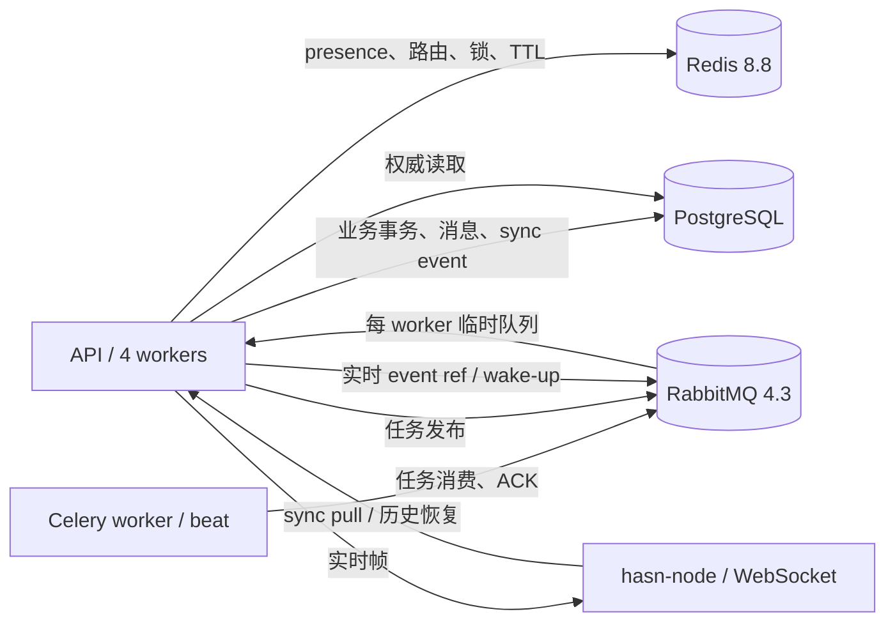

# Redis 8 与 RabbitMQ 消息基础设施迁移方案

> 状态：方案已裁决，待实施
>
> 日期：2026-07-29
>
> 范围：云端后端、Celery、传统 Socket.IO、HASN `/ws/node` 实时投递、离线恢复、Redis 8 升级
>
> 不在本方案范围：管理端功能改造、客户端 UI 改版、RabbitMQ 跨地域集群
>
> 实施文档：[`Redis 8 与 RabbitMQ 消息基础设施方案 B 实施文档`](Redis8与RabbitMQ消息基础设施方案B实施文档.md)

## 1. 执行结论

可以把 Celery、传统 Socket.IO 的跨进程通知和 HASN WebSocket 的跨 worker 唤醒迁到 RabbitMQ，但不应把 presence、锁、限流和离线消息权威数据一并塞进 RabbitMQ。

最终采用按语义分层的混合架构：

| 组件 | 权威职责 | 不承担的职责 |
|---|---|---|
| PostgreSQL | 消息、同步事件、历史快照、投递状态和离线恢复事实 | 低延迟广播、在线 presence |
| RabbitMQ | Celery broker、跨进程实时事件唤醒、短生命周期广播 | 用户消息长期存储、在线状态查询 |
| Redis 8.8 | presence、实体到节点路由、TTL、锁、限流、缓存 | Celery broker、消息历史事实源 |

裁决如下：

1. **Celery broker 迁到 RabbitMQ：立即实施，收益高。**
2. **传统 Socket.IO manager 可以迁到 RabbitMQ：作为兼容期小改实施，但不把它误认为可靠离线投递。**
3. **HASN 自定义 Redis Pub/Sub 唤醒可以迁到 RabbitMQ：在 Celery 稳定后实施，保留 PostgreSQL/Redis 可恢复底座。**
4. **离线消息不迁成“每用户一个 RabbitMQ 队列”：改由 PostgreSQL `hasn_messages`、`hasn_sync_events`、历史快照和必要的 delivery 状态共同保证。**
5. **Redis 仍然必须保留并升级到 8.8.0**，因为 RabbitMQ 不能替代 Redis 的原子键值、集合、TTL、Lua/事务和 presence 查询能力。

“换成 RabbitMQ”不会自动同时获得更低延迟和更高可靠性。RabbitMQ 的主要收益是明确的 exchange/queue 路由、消费 ACK、publisher confirm、流控、队列积压可视化和任务语义；同机瞬时广播的最低延迟通常仍是 Redis Pub/Sub 更有优势。是否迁移必须按消息语义决定，不能只为统一技术栈。

## 2. 当前事实

### 2.1 生产和代码现状

- 后端以 4 个 API worker 运行，每个 worker 只持有本进程接受的 WebSocket 连接。
- Redis Server 当前为 6.0.16，计划升级到 Redis 8.8.0。
- Celery 5.6.2 使用 Redis DB 1 作为 broker，结果后端已是 PostgreSQL。
- 传统 Socket.IO 使用 `AsyncRedisManager`；Celery 生命周期通知使用同步 `RedisManager(write_only=True)`。
- HASN IM 使用裸 WebSocket `/ws/node`，不走传统 Socket.IO。
- `/ws/node` 的跨 worker 投递由 `WsDeliveryBus` 完成：
  - Redis LIST `hasn:ws:pending:{node_id}` / `hasn:ws:processing:{node_id}` 暂存待投帧；
  - Redis Pub/Sub `hasn:ws:deliver` 唤醒所有 API worker；
  - 真正持有目标连接的 worker 校验连接代际后发送；
  - Pub/Sub 丢失时靠周期 drain 恢复。
- 离线消息使用 Redis LIST `hasn:offline:{hasn_id}`，TTL 为 7 天。
- 当前离线确认发生在服务端成功写入 WebSocket transport 之后，不等价于客户端已提交到本地 SQLite。
- PostgreSQL 已有消息、IM 集成事件、`hasn_sync_events` 和跨设备历史快照；尚无独立 `hasn_deliveries` 表。

### 2.2 四种语义不能混为一种

| 场景 | 当前实现 | 正确语义 |
|---|---|---|
| Celery 任务 | Redis broker | 至少一次任务分发、ACK、重试、积压可观测 |
| Socket.IO 任务通知 | Redis Pub/Sub | 在线时 best-effort 广播，允许离线丢失 |
| `/ws/node` 在线投递 | Redis LIST + Pub/Sub 唤醒 | 低延迟、可重复、丢唤醒后可恢复 |
| 离线消息恢复 | Redis LIST 7 天 | PostgreSQL 权威、游标重放、客户端幂等落库 |

RabbitMQ 的普通队列是竞争消费：一条消息只会交给某一个消费者。若 4 个 API worker 共用一个队列，消息可能被没有目标 WebSocket 的 worker 取走，因此这是错误拓扑。跨 worker 广播必须使用 fanout exchange，并给每个 API worker 建独立临时队列；目标 worker仍由本地连接表和 Redis connection generation 判定。

## 3. 候选方案

### 3.1 方案 A：全部迁到 RabbitMQ

做法：

- Celery、Socket.IO、自定义 Pub/Sub、pending、processing、offline 全部改成 RabbitMQ exchange/queue；
- 按 node 或 owner 创建持久队列；
- Redis 只保留普通缓存。

优点：

- 表面上技术栈统一；
- RabbitMQ 管理面可以看到队列、消费者和积压；
- ACK、TTL、DLX 等能力现成。

缺点：

- node/owner 级队列数量随用户增长，带来 Erlang 进程、binding、统计和运维开销；
- 用户切设备、连接代际变更、owner 多设备 fan-out 都要动态维护 broker topology；
- RabbitMQ ACK 只能证明某个服务消费者处理过消息，不能证明客户端 SQLite 已持久化；
- broker retention 不能替代会话 ACL、撤回、历史快照和 sync cursor；
- 同一消息会在 PostgreSQL、RabbitMQ、客户端三处产生竞争事实源；
- 一旦 RabbitMQ 数据丢失或 TTL 到期，无法从队列自身重建用户消息历史。

结论：**不采用**。

### 3.2 方案 B：按语义分层的混合架构

做法：

- RabbitMQ 承担 Celery 和跨进程实时事件唤醒；
- PostgreSQL 承担消息事实、同步事件、历史快照和离线恢复；
- Redis 8.8 承担 presence、路由、TTL、锁、限流和缓存；
- RabbitMQ 消息尽量只携带 `event_id/revision/node_id/kind`，正文由现有权威投影恢复；
- 实时事件允许重复或丢失，客户端通过 `event_id/message_id` 幂等，重连后通过 sync pull 追平。

优点：

- 每种基础设施只承担自己擅长的语义；
- 消除 Celery/Kombu 与 redis-py 的强耦合，可升级到 redis-py 8；
- RabbitMQ 故障只影响实时性，不破坏消息正确性；
- Redis 故障不再同时拖垮 Celery；
- 离线恢复不再受 Redis 7 天 TTL 限制；
- 为未来多机 API worker 和 RabbitMQ 集群保留演进路径。

缺点：

- 同时维护 PostgreSQL、Redis、RabbitMQ 三个组件；
- 需要清晰的事务后事件、幂等和回放契约；
- 迁移期需双通道和更多监控。

结论：**采用**。

### 3.3 方案 C：只迁 Celery

做法：

- Celery 改用 RabbitMQ；
- Socket.IO、`WsDeliveryBus`、offline 继续使用 Redis。

优点：

- 风险最低，能立即解除最主要的 Kombu/redis-py 约束；
- 工作量小，回滚简单。

缺点：

- 实时消息链路仍同时依赖 Redis 的数据结构与 Pub/Sub；
- Redis 离线队列仍只有 7 天；
- RabbitMQ 的路由与可观测能力没有覆盖实时链路。

结论：作为迁移第一阶段使用，不是最终状态。

## 4. 目标架构



### 4.1 正常消息路径

```text
业务事务
  → PostgreSQL 写 hasn_messages / IM event
  → 同事务或既有 durable projector 生成 hasn_sync_events
  → 事务提交
  → RabbitMQ 发布 realtime wake-up（允许重试和重复）
  → 所有 API worker 各收一份
  → 持有目标连接的 worker 校验 Redis generation
  → WebSocket 下发
  → daemon 按 event_id/message_id 幂等写 SQLite
  → 必要时回传 delivery_ack / 推进 sync cursor
```

RabbitMQ publish 失败时，消息和 sync event 已在 PostgreSQL；durable projector 或客户端周期 sync 负责追平，不允许回滚已成立的业务消息。

### 4.2 离线恢复路径

```text
节点离线期间
  → 消息仍写 PostgreSQL + hasn_sync_events
  → RabbitMQ 没有在线消费者时允许 wake-up 丢失

节点重连
  → 服务端返回 sync head / 需要同步信号
  → daemon 从持久 cursor 拉 hasn_sync_events
  → retention gap 则进入历史快照恢复
  → SQLite 幂等提交后推进 cursor
```

Redis `hasn:offline:*` 在迁移期只作为加速缓存，不再是正确性的唯一来源；当所有支持中的客户端都能从 sync pull/历史快照恢复后删除。

## 5. RabbitMQ 拓扑

### 5.1 版本和部署形态

- 目标版本：RabbitMQ 4.3 最新补丁版，当前为 4.3.4。
- Erlang/OTP：27.x。
- 初期单节点部署在现有生产服务器，数据目录放 `/data2`，避免挤占根盘。
- 端口仅绑定 `127.0.0.1`：
  - AMQP：5672；
  - Management：15672；
  - Prometheus：15692。
- 管理页面只允许 SSH 隧道访问，不开放公网。
- 生产镜像或安装包必须锁定精确版本；容器方案还必须锁 digest。

单节点 RabbitMQ 只能提供进程隔离、磁盘持久化、ACK 和流控，**不能抵抗整机故障**。需要真正 HA 时再建设 3 节点集群；在单节点上使用 quorum queue 不会凭空产生副本，反而会增加约束和开销。

### 5.2 vhost 和账号

使用独立 vhost `huanxing`，至少拆分：

| 用户 | 用途 | 权限原则 |
|---|---|---|
| `huanxing_celery` | Celery producer/worker/beat/flower | 只允许 Celery exchange、queue、reply/event 资源 |
| `huanxing_realtime` | Socket.IO 和 HASN realtime bus | 只允许 `huanxing.socketio*`、`huanxing.realtime*` |
| `huanxing_monitor` | Prometheus/管理查询 | 只读监控，不可发布和消费业务消息 |

禁止生产使用 `guest/guest`，禁止三个角色共用管理员账号。密码进入生产 `.env` 或密钥管理，不写仓库和部署文档。

### 5.3 Celery topology

第一阶段使用 durable classic queue：

- 默认 queue：`huanxing.celery.default`；
- 默认 exchange：`huanxing.celery`；
- 开启 publisher confirm；
- 配置 heartbeat、启动重连和合理 prefetch；
- 结果后端继续使用 PostgreSQL；
- Flower、remote control 和 worker events 必须实际验证。

暂不在单节点启用 quorum queue。未来 3 节点后再评估；Celery 5.6 的 quorum queue 会影响全局 QoS、autoscale、prefetch reduction 和 ETA/countdown 行为，不能只改一个队列参数就上线。

### 5.4 传统 Socket.IO topology

使用 `socketio.AsyncAioPikaManager`：

- exchange：`huanxing.socketio`，fanout、非 durable；
- 每个 Socket.IO server 自动创建独立临时 queue；
- queue 设为非 durable，并配置空闲过期；
- Celery 同步生命周期通知可使用 `KombuManager(write_only=True)`，但必须做同步 publisher → 异步 manager 的真实互通测试。

该 manager 的语义仍是在线广播。即使消息属性标记 persistent，只要临时 queue 不存在或已删除，通知仍然丢失，因此它不能用于离线消息。

传统 Socket.IO 当前只承载任务通知和 worker 状态，不承载 HASN IM。迁移完成后应单独评估是否直接退役这条遗留通道，避免长期维护两套 WebSocket 协议。

### 5.5 HASN realtime topology

第一版坚持简单：

- exchange：`huanxing.realtime`，fanout；
- 每个 API worker 创建 `huanxing.realtime.worker.<instance_id>` 临时 queue；
- queue 为 exclusive/auto-delete，空闲 5 分钟过期；
- 每条事件包含 `event_id`、`kind`、`node_id` 或 `broadcast`、`revision` 和最小必要 payload；
- 每个 worker 都消费一份，只有持有目标 WebSocket 且 generation 匹配的 worker 下发；
- 非目标 worker直接 ACK；
- 下发失败不在 RabbitMQ 中无限 requeue，由 PostgreSQL sync 和现有 pending 恢复。

当前只有 4 个 API worker，fanout 成本很低。不要在首版引入 node 级动态 binding。只有达到以下任一阈值并有压测证据时，才改为 topic/direct exchange：

- API worker 超过 16；
- 实时 wake-up 持续超过 5,000 条/秒；
- 非目标 worker过滤消耗超过单核 10%；
- RabbitMQ fanout 网络放大成为主要瓶颈。

## 6. 哪些 Redis 能力不能迁到 RabbitMQ

以下能力继续留在 Redis 8.8：

- `hasn:node_generation`、`hasn:entity_node`、`hasn:user_nodes:*` 路由索引；
- `hasn:node_alive:*`、`hasn:agent_ready:*` 心跳 TTL；
- 登录、短信、验证码、OAuth state、限流；
- 分布式锁和 Beat 锁；
- 原子集合、计数、pipeline 和短期缓存；
- WebSocket 连接代际切换时的原子校验。

RabbitMQ 可以传递“某节点上线/下线”的事件，但不能高效回答“主体当前在哪个 node”“TTL 是否过期”“当前 generation 是否仍有效”。如果把这些查询改成扫描 broker queue 或依赖消费者本地副本，会破坏现有跨 worker 权威判定。

Redis 8 升级后可把 Redis 6 兼容的 LIST Lua 领取逻辑改为原生 `LMOVE`；在 realtime pending 最终由 PostgreSQL 恢复机制替代前，仍保留这层保护。

## 7. 离线消息裁决

### 7.1 为什么不使用每用户 RabbitMQ 队列

“每个 owner/agent 一个 durable queue，保留 7 天”看似直接，但存在以下问题：

- 每个 queue 都是 RabbitMQ topology 和运行时资源，用户增长会放大 queue/binding/metrics 数量；
- owner 多设备需要 fan-out，单队列竞争消费不能覆盖所有设备；
- 设备切换和 Agent 接管需要处理旧 queue、旧 binding 和 connection generation；
- RabbitMQ ACK 发生在云端消费者，不能代表 daemon 已写入本地 SQLite；
- RabbitMQ 消息 TTL 到期后无法重建历史；
- ACL、撤回、成员周期、主人透明视图和历史快照仍然必须查询 PostgreSQL；
- broker 恢复和业务消息恢复会形成两个不同游标。

### 7.2 推荐实现

1. `hasn_messages` 和 IM event 继续作为消息事实。
2. `hasn_sync_events` 继续提供 owner 维度有序、可重放的 durable feed。
3. RabbitMQ 只发布 `event_id/revision` wake-up。
4. daemon 收到 wake-up 后可立即应用同构实时帧；发现 gap、重复或重连时统一走 sync pull。
5. sync retention gap 继续走已完成的“快照上界 + 稳定分页 + 幂等落库 + 增量追平”。
6. 若需要精确记录 per-recipient `pending/delivered/read/failed`，再补建 `hasn_deliveries`；新表必须先写 SQL，再按云端 codegen 流程生成 model/schema/crud，禁止手写新表模型。
7. 客户端 ACK 必须在 SQLite 事务提交后发出，不能把“写入 WebSocket transport”当作最终 delivery ACK。

最终删除 Redis `hasn:offline:*` 的门槛：

- 支持中的所有桌面/移动客户端均实现 durable sync cursor；
- 空库历史恢复、retention gap 和断网重连 E2E 全绿；
- 双设备并发新消息无遗漏且用户可见恰好一次；
- 连续 7 天 shadow 对账中，Redis offline 列表没有出现 PostgreSQL/sync 无法恢复的独有消息；
- 回滚时可以从 PostgreSQL 重建加速缓存。

## 8. 收益与工作量

### 8.1 分链路收益

| 链路 | 性能收益 | 稳定性收益 | 运维收益 | 裁决 |
|---|---|---|---|---|
| Celery → RabbitMQ | 中 | 高 | 高 | 立即迁 |
| Socket.IO manager → RabbitMQ | 低，可能略增延迟 | 低到中 | 中 | 兼容期迁，后续退役 |
| HASN Pub/Sub wake-up → RabbitMQ | 低到中 | 中 | 高 | 第二阶段迁 |
| Redis offline → RabbitMQ durable queue | 不确定 | 负收益风险 | 低 | 不迁 |
| Redis offline → PostgreSQL sync | 中长期高 | 高 | 高 | 第三阶段迁 |
| presence/路由 → RabbitMQ | 负收益 | 负收益 | 负收益 | 禁止迁 |

RabbitMQ 的稳定性收益依赖正确使用 publisher confirm、manual ACK、mandatory/returned message、持久 queue、磁盘和内存告警。只把连接 URL 从 Redis 改成 AMQP，不会自动获得可靠性。

### 8.2 人日估算

| 工作包 | 主要内容 | 估算 |
|---|---|---:|
| RabbitMQ 基础设施 | 4.3.4、Erlang 27、vhost/账号、定义导入、端口、安全、备份、监控 | 2–4 人日 |
| Celery 迁移 | 配置、queue、confirm、drain、beat/worker/flower、ETA/retry E2E | 2–3 人日 |
| Socket.IO 迁移 | AsyncAioPikaManager、同步 publisher 互通、回滚开关 | 1–2 人日 |
| HASN realtime bus | port/adapter、Rabbit consumer、双发、重连、4 worker E2E | 5–8 人日 |
| 离线恢复收口 | sync 驱动、ACK/cursor、shadow 对账、必要 delivery 表、删除 Redis 权威依赖 | 8–15 人日 |
| OTel/Grafana/runbook | RabbitMQ 指标、trace、告警、故障演练、部署和回滚文档 | 4–6 人日 |
| **合计** | 不含 3 节点 HA 建设 | **22–38 人日** |

单人串行约 5–8 周；两人按“基础设施/Celery”和“IM realtime/offline”拆分约 3–5 周。若只完成 RabbitMQ + Celery + Socket.IO，不动 HASN realtime/offline，约 5–9 人日。

## 9. 分阶段实施

### 阶段 0：基线与开关

新增并统一以下配置：

```text
CELERY_BROKER=redis|rabbitmq
SOCKETIO_MANAGER=redis|rabbitmq
HASN_REALTIME_BUS=redis|rabbitmq
HASN_REALTIME_SHADOW_RABBITMQ=false|true
HASN_OFFLINE_RECOVERY=redis|dual|sync
```

要求：

- 默认仍指向现网实现；
- 启动时记录最终选择，但日志不得打印密码或完整 URL；
- 建立 Redis Pub/Sub 和 RabbitMQ 的同负载基线；
- 记录在线投递 p50/p95/p99、漏唤醒、重复、重连时间和 CPU。

### 阶段 1：部署 RabbitMQ

1. 在 `/data2` 部署 RabbitMQ 4.3.4 和 Erlang 27。
2. 仅监听 loopback，创建 `huanxing` vhost 和最小权限账号。
3. 启用 management 与 Prometheus plugin。
4. 导入版本化 definitions，确认重启后 topology 可恢复。
5. 配置绝对内存水位、磁盘低水位、文件句柄、连接/channel/vhost 限额。
6. 通过 SSH 隧道验证管理面，确认公网端口不可达。
7. 接入现有 Prometheus/Grafana 和告警。

### 阶段 2：Celery 切换

1. 升级 Celery 到 5.6.3，保持 PostgreSQL result backend。
2. 在测试环境用真实 RabbitMQ 覆盖：
   - 普通任务、失败重试、autoretry；
   - ETA/countdown、Beat 周期任务；
   - active/reserved/scheduled/inspect；
   - Flower events、远程控制；
   - worker 重启、RabbitMQ 重启、连接恢复。
3. 生产切换前停止 Beat，等待 Redis broker 的 active/reserved/scheduled 清空。
4. 停止 worker，确认 Redis DB 1 无待消费 Celery queue。
5. 设置 `CELERY_BROKER=rabbitmq`，启动 worker，再启动 Beat 和 Flower。
6. 发布真实无副作用任务并确认 PostgreSQL result。
7. Redis broker 保留但不写入一个观察窗口，之后清理旧 Celery key。

回滚必须再次停止 Beat、排空 RabbitMQ 后切回 Redis。两个 broker 不能同时由 Beat 发布，否则会产生重复任务。

### 阶段 3：Redis 8.8 升级

Celery 已解耦后再完成 Redis 6.0.16 → 8.8.0 蓝绿切换：

1. 新端口部署 Redis 8.8.0；
2. 恢复并验证 Redis 6 的 RDB；
3. 升级 redis-py 8.0.1，显式配置 RESP3；
4. 验证 presence、锁、TTL、Lua/LMOVE、pipeline、Socket.IO 和 realtime fallback；
5. 分批切 API worker；
6. 保留旧实例到观察窗口结束。

### 阶段 4：传统 Socket.IO 切换

1. API server 使用 `AsyncAioPikaManager`。
2. Celery 同步通知 publisher 使用兼容 manager。
3. 用真实 RabbitMQ 验证 API 与 Celery 进程之间双向格式互通。
4. `SOCKETIO_MANAGER=rabbitmq` 灰度切换。
5. 若任务通知在产品中已无消费者，另立小任务退役整个传统 Socket.IO，不把临时迁移永久化。

### 阶段 5：HASN realtime bus 切换

1. 抽象 `RealtimeWakeupBus` port，保留 Redis 与 RabbitMQ 两个 adapter。
2. 设置 `HASN_REALTIME_SHADOW_RABBITMQ=true`，双发相同 `event_id`；Redis 继续实际驱动，Rabbit consumer 只做 shadow 计数。
3. Rabbit consumer 在每个 API worker 启动，连接重建使用 robust connection。
4. shadow 达标后设置 `HASN_REALTIME_BUS=rabbitmq`、关闭 shadow；验证 generation、首帧顺序和跨 worker 投递。
5. Redis Pub/Sub 保留为紧急回滚开关。
6. 连续观察后关闭 Redis Pub/Sub，暂时保留 Redis pending/processing LIST。

### 阶段 6：离线恢复切换

1. 将 Rabbit wake-up 与 `hasn_sync_events` 的 `event_id/revision` 对齐。
2. daemon SQLite 提交成功后再推进 cursor/回传 ACK。
3. `dual` 阶段同时写 Redis offline 加速缓存和 PostgreSQL sync，按消息 ID 对账。
4. 断网、RabbitMQ 停机、Redis 停机时验证 PostgreSQL sync 仍可恢复。
5. 达到 §7 门槛后停止写 Redis offline LIST。
6. 观察一个完整旧 TTL 周期后删除旧 key 和兼容代码。

## 10. 验收门槛

### 10.1 功能

- Celery 任务发送、消费、重试、ETA、Beat、Flower 全绿；
- 传统 Socket.IO 任务通知从真实 Celery worker 到真实客户端；
- 4 API worker 下，连接随机落到任意 worker，定向帧只由正确 generation 下发；
- broadcast 覆盖所有 ready 连接；
- RabbitMQ 断开和恢复不要求重启 API；
- 同一 realtime event 重复两次，客户端只呈现一次；
- owner 双设备在线时两端都收到；一端离线后重连能追平；
- 7 天以上离线不依赖 Redis LIST 也能通过 PostgreSQL 快照恢复；
- 消息撤回、ACL、群成员周期和 owner copy 不因 broker 改造改变。

### 10.2 故障演练

- RabbitMQ 在 publish 前、confirm 前、consumer ACK 前分别中断；
- API worker 在 WebSocket send 前后退出；
- Redis 重启导致 generation/presence 短暂缺失；
- PostgreSQL projector 暂停后恢复；
- RabbitMQ queue 满、磁盘告警、内存告警；
- 网络闪断后 producer/consumer 自动恢复且无无限重连洪水；
- 双通道切换和回滚不会产生用户可见重复消息。

### 10.3 性能

在同一台生产规格机器上对比迁移前后：

- 在线消息端到端 p95 不劣化超过 10%；
- p99 不超过 200 ms；
- 目标 worker wake-up 丢失率为 0；重复允许存在但用户可见重复为 0；
- RabbitMQ `messages_unacknowledged` 不持续增长；
- Celery queue 可在预期时间内回落到 0；
- 单个 API worker 重启不影响其它 worker 的连接投递；
- RabbitMQ/Redis 的 CPU、内存和磁盘均有至少 30% 安全余量。

若 RabbitMQ realtime 无法通过性能门槛，保留 RabbitMQ 给 Celery，实时 wake-up 回滚 Redis Pub/Sub；这不影响 Redis 8 和 Celery 解耦的收益。

## 11. 可观测性

### 11.1 RabbitMQ 指标

接入官方 Prometheus plugin，至少监控：

- node 可用性、连接数、channel 数；
- publish、confirm、return、deliver、ack、redelivery 速率；
- `messages_ready`、`messages_unacknowledged`；
- consumer 数与 consumer capacity；
- memory alarm、disk alarm、文件句柄；
- queue/exchange churn；
- 连接认证失败和权限拒绝。

告警至少包括：

- RabbitMQ endpoint down；
- Celery queue 或 unacked 持续增长；
- realtime worker queue 没有 consumer；
- publisher return/nack；
- memory/disk alarm；
- API/Celery 重连循环；
- PostgreSQL sync lag 超阈值。

### 11.2 OpenTelemetry

- Celery 和 realtime publish/consume 建立统一 trace；
- 使用 `messaging.system=rabbitmq`、exchange、operation 等低基数字段；
- 不把 `owner_id/node_id/message_id/event_id` 作为 metrics label；
- trace 可记录这些 ID，但必须遵循采样和敏感信息策略；
- 不记录密码、完整 AMQP URL 和消息正文。

## 12. 安全要求

- 5672、15672、15692 均不得暴露公网；
- 删除或禁用默认 `guest`，使用独立强密码用户；
- vhost、configure/write/read 权限按资源前缀最小化；
- Management 账号与业务账号分离；
- 密钥仅在生产 `.env`/密钥管理和本机忽略文件中保存；
- RabbitMQ definitions 不包含明文密码；
- realtime 消息体优先只包含资源引用和 revision，避免在 broker 重复持久化正文；
- 限制最大消息体、queue length、TTL、连接数和 channel 数；
- 管理面通过 SSH 隧道访问，并纳入现有 Grafana 安全策略；
- 多机部署时使用私网；跨主机链路再启用 TLS 和证书轮换。

## 13. 回滚原则

| 阶段 | 回滚方式 | 数据注意事项 |
|---|---|---|
| RabbitMQ 部署 | 停止消费者并保留实例 | 尚无业务消息，无数据迁移 |
| Celery 切换 | 停 Beat，排空 RabbitMQ，切回 Redis | 两个 broker 不能同时有待处理任务 |
| Socket.IO | 配置切回 `redis` | 通知是瞬时消息，不补历史 |
| Realtime bus | 切回 Redis 驱动，Rabbit 只 shadow | `event_id` 去重，避免双驱动 |
| Offline sync | 重新启用 Redis 加速缓存 | PostgreSQL 始终是权威，不回退事实源 |
| Redis 8 | 在冻结新写后切回旧端口 | 新 Redis 已有写入时不能盲目回指旧实例 |

每一阶段都必须独立上线、独立观察、独立回滚；禁止把 RabbitMQ、Redis 8、realtime bus 和 offline 收口一次性全量切换。

## 14. 参考资料

- [RabbitMQ 版本与支持周期](https://www.rabbitmq.com/release-information)
- [RabbitMQ 可靠性指南](https://www.rabbitmq.com/docs/reliability)
- [RabbitMQ consumer ACK 与 publisher confirm](https://www.rabbitmq.com/docs/confirms)
- [RabbitMQ production checklist](https://www.rabbitmq.com/docs/production-checklist)
- [RabbitMQ 访问控制](https://www.rabbitmq.com/docs/access-control)
- [RabbitMQ Prometheus 与 Grafana](https://www.rabbitmq.com/docs/prometheus)
- [RabbitMQ TTL](https://www.rabbitmq.com/docs/ttl)
- [RabbitMQ quorum queue](https://www.rabbitmq.com/docs/quorum-queues)
- [Celery 使用 RabbitMQ](https://docs.celeryq.dev/en/main/getting-started/backends-and-brokers/rabbitmq.html)
- [python-socketio 使用 Redis/RabbitMQ message queue](https://python-socketio.readthedocs.io/en/stable/server.html#using-a-message-queue)
- [Redis 8.8 发布说明](https://redis.io/docs/latest/develop/whats-new/8-8/)
- [跨设备消息历史快照恢复设计](https://github.com/youngshunf/huanxing-project/blob/main/docs/hasn-node设计文档/多设备登录与跨设备消息路由/03-跨设备消息历史快照恢复设计.md)
